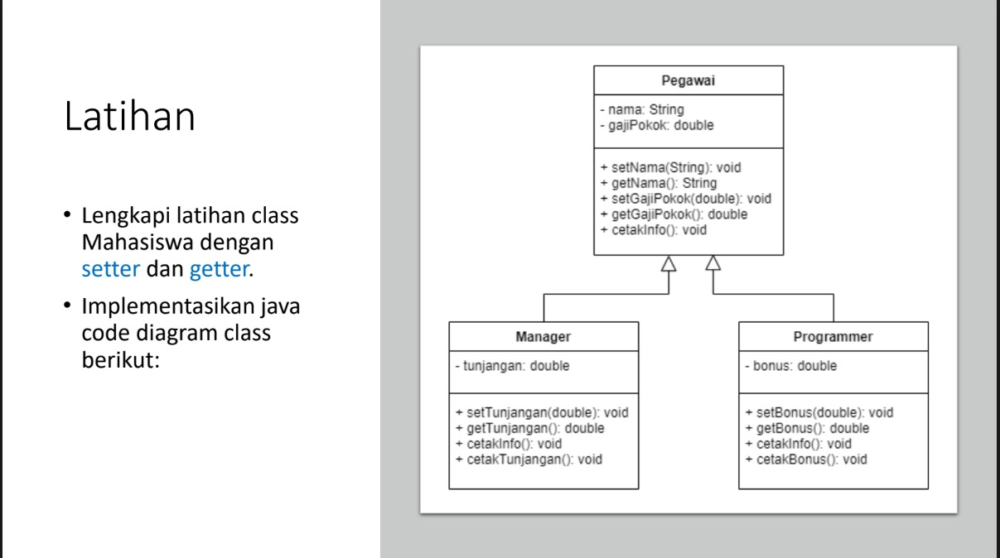

# Pemograman-Orientasi-Objek_latihan4

## `Nama : Agus Setiawan Nim : 312310597 Kelas : TI.23.A6`

 

# Soal

 

 

# Jawaban

 

## ● Latihan 1

<ol>
<li><strong>Apa yang harus didefinisikan sebelum membuat objek?</strong> 
  <i>  > Sebelum membuat objek, kita perlu mendefinisikan sebuah <b>class</b> sebagai rancangan atau <b>blueprint</b> dari objek yang akan kita buat.</i>
</li> 
<li><strong>Buatlah gambar diagram class dan dua buah objek dari class Person bernama Antor dan Riko!</strong> 
  <i>  > <b>Class Diagram</b> &emsp; &emsp; &emsp; &emsp; &emsp; &nbsp; &nbsp; &emsp; &nbsp;  > <b>Object Instances</b> </i>
          &emsp;          </li> 
</li> 
<li><strong>Buatlah gambar diagram objek AkunBank dengan instance method simpan Uang, ambilUang dan cekSaldo!</strong> 
  <i>  > <b>Class Diagram</b> &emsp; &emsp; &emsp; &emsp; &emsp; &nbsp; &nbsp; &emsp; &nbsp; &emsp; &emsp; &emsp; &emsp; &emsp;  > <b>Object Instances</b> </i>
    &emsp; 
</li> 
</ol>

## ● Latihan 2

**Buatlah kode program java untuk:**
* Mendeklarasikan class Person, dengan atribut Nama,JenisKelamin, Umur
* Buatlah dua buah objek dari class Person bernama Anton dan Riko

 

### Kode

 

<a href=https://github.com/AgusSetiawn/Pemograman-Orientasi-Objek_latihan2/blob/5f23b0fa5be275f0e7c575a432315fa401aee66e/Kode%20Java/Person/Person.java><strong><i>Salin Kode</i></strong></a>

 

### Output

 

 

## ● Latihan 3

**Buatlah kode java untuk:**
* Mendeklarasikan class AkunBank dengan instance method simpanUang, ambilUang dan cekSaldo
* Buat objek AkunBank dan tetapkan nilai saldo awal Rp. 100000, kemudian panggil 3 method tersebut dan tampilkan proses

 

### Kode

 

<a href=https://github.com/AgusSetiawn/Pemograman-Orientasi-Objek_latihan2/blob/main/Kode%20Java/AkunBank/AkunBank.java><strong><i>Salin Kode</i></strong></a>

 

### Output

 

 
